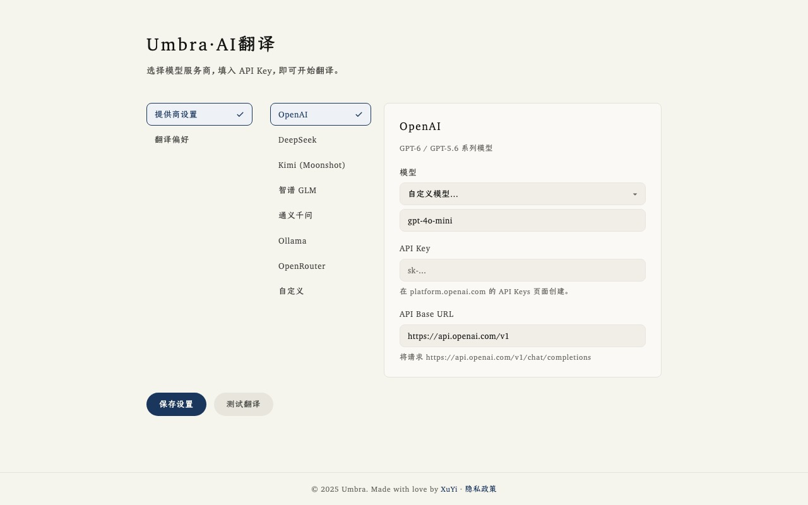
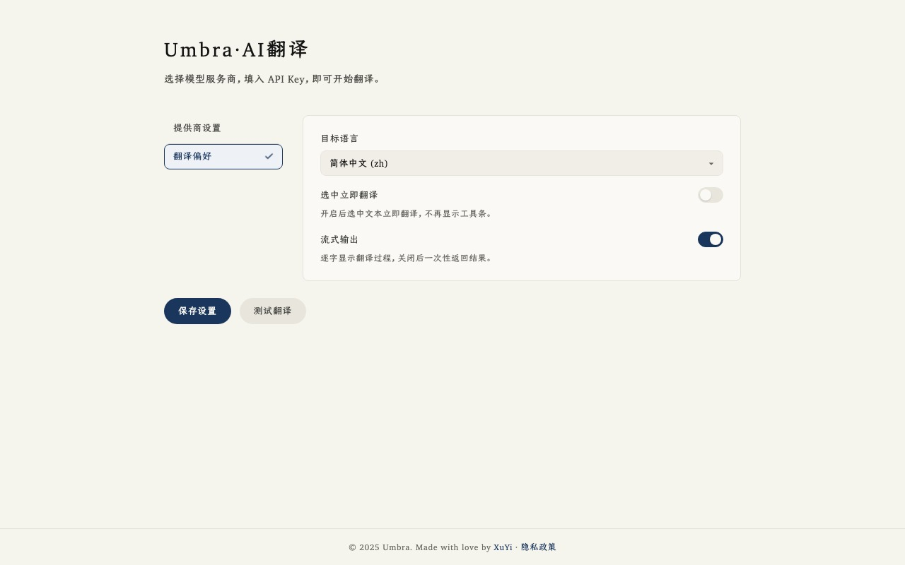

<p align="center">
  
</p>

# Umbra · 网页 AI 翻译（Manifest V3）

Chrome / Edge 浏览器扩展：划词翻译 + 全文翻译，使用 OpenAI 兼容 Chat Completions API（自带 API Key / BYOK）。

代码以 [MIT 许可证](LICENSE) 开源。

<p align="center">
  
</p>
<p align="center">
  
</p>

## 功能

- **划词翻译**：选中文本后浮出「翻译」按钮，点击后弹出浮动气泡显示译文
- **全文翻译**：一键翻译页面可见文本，并可恢复原文
- **BYOK**：在选项页配置 Base URL、API Key、模型与目标语言
- 兼容任意 OpenAI 兼容接口（可自定义 Base URL）
- 默认目标语言：简体中文（zh）

## 环境要求

- Node.js 18+（仅开发/构建需要）
- Chrome 或 Edge（支持 Manifest V3）

## 安装依赖并构建

```bash
cd web-translator
npm install
npm run build
```

构建产物在 `dist/` 目录。

## 加载到 Chrome / Edge（开发者模式）

1. 打开浏览器，地址栏进入：
   - Chrome：`chrome://extensions`
   - Edge：`edge://extensions`
2. 打开右上角 **「开发者模式」**
3. 点击 **「加载已解压的扩展程序」**（Load unpacked）
4. 选择本项目的 **`dist`** 目录（完整路径示例见下方）
5. 固定扩展图标后，点击扩展 → **「打开选项」**，填写：
   - API Base URL（如 `https://api.openai.com/v1`）
   - API Key
   - 模型名称（如 `gpt-4o-mini`）
   - 目标语言（默认简体中文）
6. 保存后即可在网页上划词翻译，或用弹窗/右键菜单触发全文翻译

### 若你已拿到打包好的 zip

1. 解压 `web-translator.zip`
2. 若其中已有 `dist/`，可直接在扩展管理页加载该 `dist` 文件夹（无需再 `npm install`）
3. 若只有源码、没有 `dist/`，先执行 `npm install && npm run build`，再加载 `dist`

## 使用说明

| 操作 | 说明 |
|------|------|
| 划词 | 鼠标选中文本后浮出工具条：「翻译」弹出翻译气泡；「翻译为」打开面板，选语言生成结果后「确认替换」到原文；`Esc` 或点击外部关闭。开启「选中立即翻译」后划词直接翻译 |
| 弹窗 | 「翻译整个网页」/「恢复原文」/「打开选项」 |
| 右键菜单 | 翻译选中文本 / 翻译整个网页 / 恢复原文 |

API 请求均由 **background service worker** 发起，API Key 保存在 `chrome.storage.local`。

## 开发

```bash
npm run dev
```

使用 Vite + `@crxjs/vite-plugin` 进行 MV3 开发构建。列表选中动画和布尔开关见 [docs/设计规约.md](docs/设计规约.md)。

## 目录结构

```
web-translator/
  package.json
  vite.config.ts
  tsconfig.json
  manifest.config.ts
  public/icons/
  src/
    background/     # Service Worker（API 调用）
    content/        # 划词气泡 + 全文翻译
    options/        # 选项页
    popup/          # 扩展弹窗
    providers/      # OpenAI 兼容 Provider
    shared/         # 类型、存储、消息
  dist/             # 构建输出（加载此目录）
```

## 注意事项

- `chrome://`、`edge://`、Chrome 网上应用店等受限页面无法注入内容脚本
- 全文翻译会批量请求模型，长页面可能消耗较多 Token，耗时取决于模型与网速
- 请勿将含真实 API Key 的配置提交到公开仓库
- 隐私政策（公开）：https://gist.github.com/08820048/b2ba7bf47854d6eb32a8ac3ab2d1cff3
